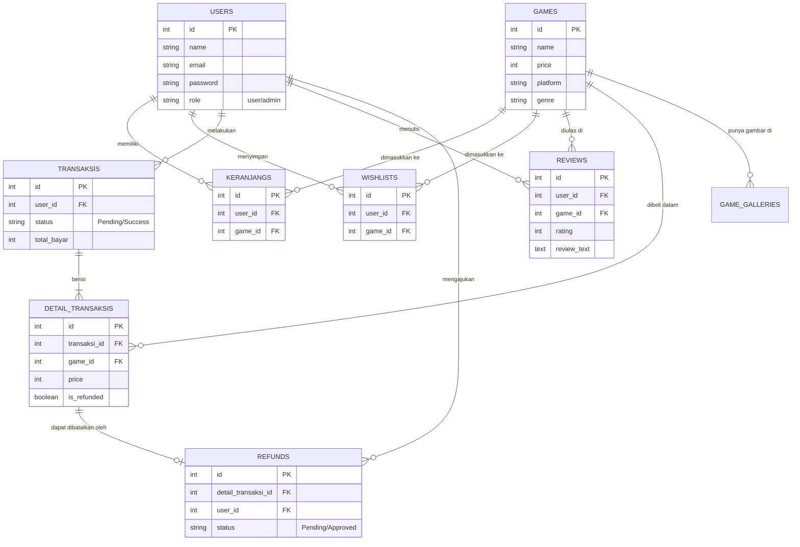

# Bahan Tambahan Presentasi GameVault

Berikut adalah jawaban lengkap untuk tambahan materi di slide presentasi kamu!

## 1. Gambar Diagram MVC (Model-View-Controller)
**"Dapat dari mana gambarnya?"**
Untuk gambar diagram MVC, kamu bisa mencarinya di Google Images dengan kata kunci pencarian: **"Laravel MVC Architecture Diagram"** lalu pilih gambar yang paling bagus dan *simple* (biasanya yang ada panah melingkar antara Router -> Controller -> Model -> View).

**Penjelasan untuk Dosen (Jika Ditanya):**
*   **Model (Database):** Tempat sistem berhubungan dengan Database. Contoh di GameVault: `User.php`, `Game.php`, `Transaksi.php`.
*   **View (Tampilan):** File HTML/CSS yang dilihat oleh pengguna (Frontend). Di Laravel menggunakan ekstensi Blade. Contoh: `index.blade.php`.
*   **Controller (Otak/Logika):** Jembatan penghubung antara Model dan View. Contoh: `CheckoutController.php` bertugas mengambil harga dari Model, lalu mengirim datanya ke View untuk dicetak menjadi struk PDF.

---

## 2. Fitur-Fitur Sisi User (Pengguna Biasa)
Ini adalah fitur-fitur yang hanya bisa dilakukan oleh Pembeli:
1.  **Sistem Autentikasi:** Mendaftar akun baru, Login, dan Logout yang aman.
2.  **Katalog & Pencarian:** Menjelajah game di beranda, melakukan pencarian pintar (Autocomplete), dan filter multi-centang (Genre, Harga).
3.  **Aktivitas Belanja:** Memasukkan game ke Wishlist dan Keranjang tanpa pindah halaman (AJAX).
4.  **Sistem Pembayaran:** Melakukan proses Checkout terpusat menggunakan Midtrans (QRIS/Gopay/dll) dengan pembaruan status otomatis (Webhook).
5.  **Aktivitas Pasca-Beli:** Mengunduh Struk Pembelian (PDF Invoice) dan menerima lisensi otomatis lewat Email (Mailtrap).
6.  **Library Game:** Mengakses kotak penyimpanan game yang berhasil dibeli.
7.  **Sistem Ulasan (Review):** Memberikan penilaian bintang dan teks ulasan HANYA untuk game yang telah lunas dibeli.
8.  **Sistem Refund:** Meminta pengembalian uang (jika game bermasalah dan dibeli di bawah 14 hari).
9.  **Pengaturan Profil:** Mengganti Foto Profil dengan pemotong cerdas (Cropper Base64), mengganti Email dengan keamanan OTP, dan mengganti Password.

---

## 3. Fitur-Fitur Sisi Admin
Ini adalah hak istimewa yang **TIDAK BISA** dilakukan oleh user biasa (Dilindungi Middleware `IsAdmin`):
1.  **Dashboard Statistik:** Memantau Ringkasan Total Data dan melihat Grafik Pendapatan Bulanan yang otomatis terhitung.
2.  **Kelola Game (CRUD):** Menambahkan game baru (termasuk upload gambar sampul yang aman dari penumpukan/bentrok nama file), mengubah data game, dan menghapus game.
3.  **Kelola Transaksi:** Memantau seluruh arus uang masuk dari semua pengguna, melacak transaksi gagal/sukses, dan mengunduh laporan PDF di peramban (browser).
4.  **Kelola Pengguna:** Memantau seluruh pengguna terdaftar, serta 'mengintip' isi keranjang dan riwayat belanja pengguna melalui fitur Accordion Table.
5.  **Kelola Pengembalian Dana (Refund):** Mendapat *Toast Notification* saat ada yang meminta refund, lalu memproses penarikan uang dan pencabutan lisensi game dari Library pengguna secara mutlak.

---

## 4. Gambar ERD (Entity Relationship Diagram)
*Catatan: Ini adalah diagram ERD Visual untuk database GameVault. Kamu bisa langsung melakukan Screenshot/Screen-capture pada gambar kotak-kotak di bawah ini dan menempelkannya di PowerPoint!*

---

## 5. Penjelasan Relasi Database (Untuk Presentasi)
Jika dosen bertanya, *"Bagaimana tabel-tabel di database kamu saling berhubungan?"* Jawab dengan ini:

1.  **Relasi One-to-Many (1 ke Banyak) yang Dominan:**
    *   **User ke Transaksi:** Satu User (1) bisa melakukan banyak Transaksi (M). Maka `id` di tabel User ditarik menjadi `user_id` (Foreign Key) di tabel Transaksi.
    *   **User ke Keranjang/Wishlist/Review:** Satu User bisa punya banyak item di keranjang, wishlist, atau memberikan banyak review.
    *   **Game ke Review/Keranjang/Wishlist:** Satu Game (1) bisa dimasukkan ke keranjang oleh banyak user (M), atau diulas oleh banyak user (M).

2.  **Relasi Transaksi ke Detail Transaksi (Penting!):**
    *   **Transaksi (Induk):** Menyimpan data 'Bon Belanja' secara global (Kapan dibeli, total harganya berapa, statusnya lunas atau belum).
    *   **Detail Transaksi (Anak):** Di dalam 1 Bon Belanja (Transaksi), user bisa saja memborong 3 Game sekaligus. Maka, rincian game apa saja yang dibeli itu disimpan di dalam tabel `DetailTransaksi`. Ini juga memudahkan jika user HANYA ingin *Refund* 1 game saja dari 3 game yang ia beli secara serentak.

3.  **Relasi Tabel Refund (Pengembalian Uang):**
    *   Tabel Refund tidak langsung terhubung ke tabel Transaksi utama, melainkan terhubung ke **Detail Transaksi**. Alasannya seperti di atas: agar sistem bisa mengidentifikasi spesifik game mana yang mau dibatalkan lisensinya tanpa mengganggu game lain di dalam satu struk belanja yang sama.
